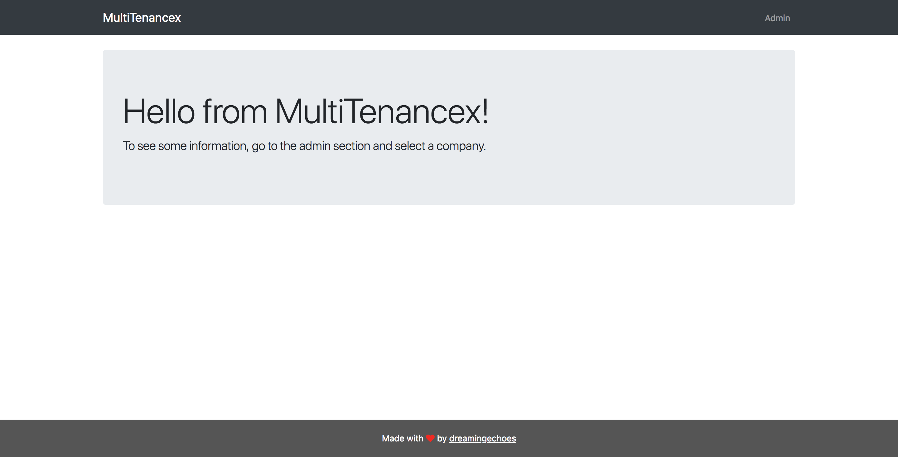
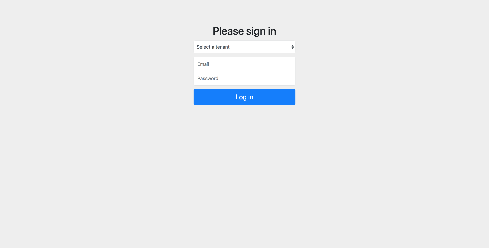
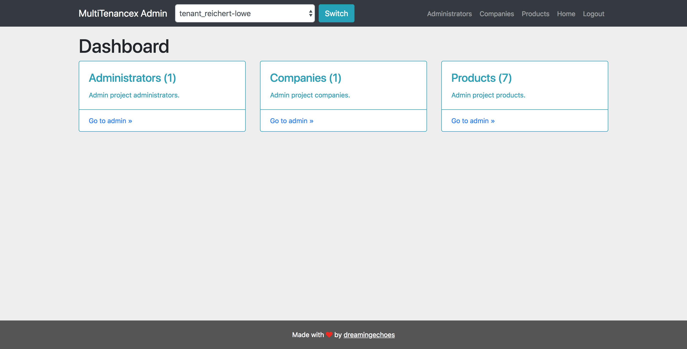
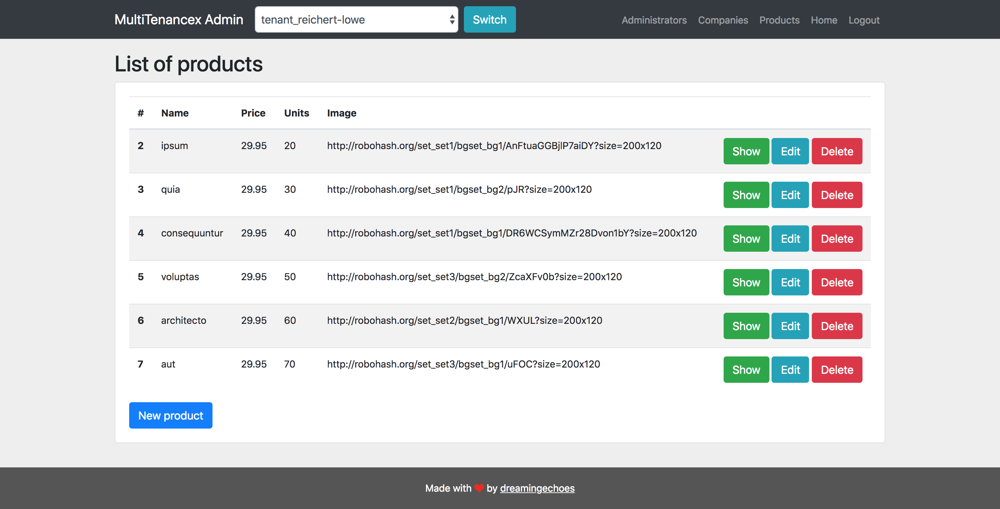
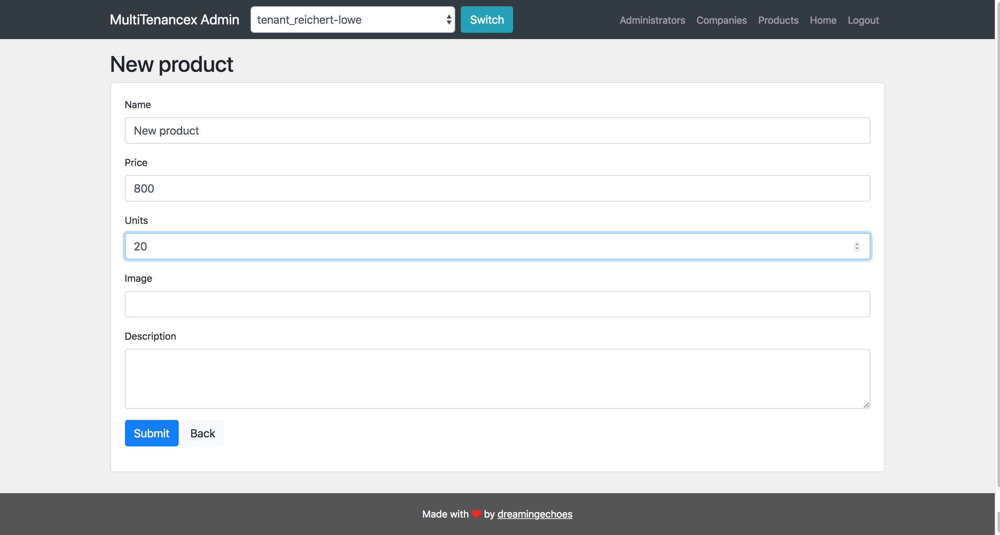
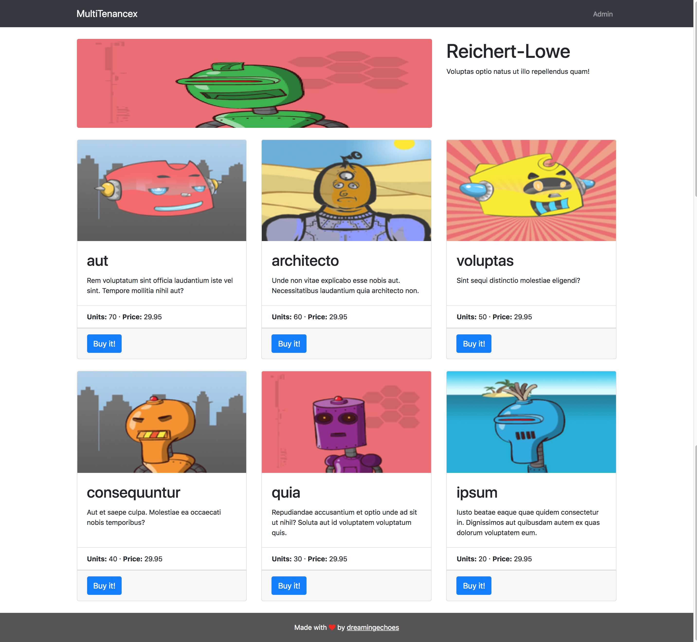

# MultiTenancex

[](https://circleci.com/gh/dreamingechoes/multi_tenancex)

Example of Phoenix application with database multi-tenancy. A practical way to see the concepts tackled
in [this post from my website](http://dreamingecho.es/blog/a-dive-into-database-multi-tenancy-in-elixir-with-ecto).

## Images


Home.


Login.


Admin Dashboard.


Admin Product Index.


Admin Product New.


Company Home.

## Example data

There's a user in the seeds to use for testing purposes:

- **Email**: example@example.com
- **Password**: 123456

## Special database multi-tenant mix tasks

If you want to **create** some migration for every tenant:


```
> docker-compose run multi_tenancex mix multi_tenancex.gen.tenant_migration create_some_table
```


If you want to **migrate** the migrations for every tenant:


```
> docker-compose run multi_tenancex mix multi_tenancex.ecto.migrate_tenants
```

If you want to **rollback** the migrations for every tenant:


```
> docker-compose run multi_tenancex mix multi_tenancex.ecto.rollback_tenants
```

## Setup development environment with Docker

This project is Docker friendly from day one. To start working on it:

* Setup the multi_tenancex container with `docker-compose build multi_tenancex`.
* Install dependencies with `docker-compose run multi_tenancex mix deps.get`.
* Create your database with `docker-compose run multi_tenancex mix ecto.create`.
* Migrate your database with `docker-compose run multi_tenancex mix ecto.migrate`.
* Run seeds for default data with `docker-compose run multi_tenancex mix run priv/repo/seeds.exs`.
* Install Node.js dependencies with `docker-compose run multi_tenancex bash -c "cd assets; npm install"`.
* Start the application with `docker-compose up`

## Setup testing environment with Docker

This step assumes you already followed instructions from previous paragraph.

* Create your testing database with `docker-compose run multi_tenancex env MIX_ENV=test mix ecto.create`.
* Migrate your testing database with `docker-compose run multi_tenancex env MIX_ENV=test mix ecto.migrate`.
* Run the test suite with `docker-compose run multi_tenancex env MIX_ENV=test mix test`.
* Run the test suite with coverage report on `cover` folder with: `docker-compose run multi_tenancex env MIX_ENV=test mix coveralls.html`.

----------------------------

This project was developed by [dreamingechoes](https://github.com/dreamingechoes).
It adheres to its [code of conduct](https://github.com/dreamingechoes/base/blob/master/files/CODE_OF_CONDUCT.md) and
[contributing guidelines](https://github.com/dreamingechoes/base/blob/master/files/CONTRIBUTING.md), and uses an equivalent [license](https://github.com/dreamingechoes/base/blob/master/files/LICENSE).
